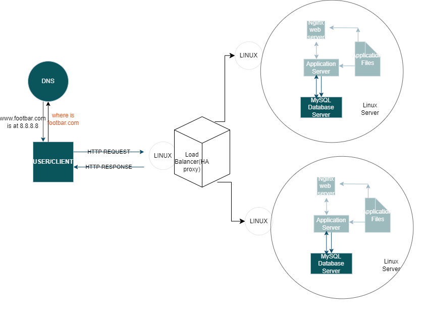

# Distributed web infrastructure

# Definition
This a distributed web infrastructure with two servers and one HAproxy load balancer provides scalability, reliability, and performance benefits by distributing workloads across multiple servers and efficiently managing incoming traffic. This architecture helps ensure that the web application remains available and responsive even during periods of high demand or server failures.
# The specifics
+ The HAProxy load balancer is set up with the Round Robin distribution algorithm, which operates by cycling through each server behind the load balancer based on their assigned weights. This algorithm ensures a fair distribution of processing time across all servers, promoting smooth operation. Additionally, it's adaptable, allowing for real-time adjustments to server weights.

+ The setup facilitated by the load balancer is an Active-Passive configuration rather than Active-Active. In Active-Active setups, workloads are distributed across all nodes to prevent overload on any single node, resulting in improved throughput and response times. Conversely, in an Active-Passive setup, not all nodes are continuously active. For instance, in a two-node configuration, one node remains active while the other is on standby. If the active node becomes inactive, the next passive node becomes active.
+ In a Primary-Replica (Master-Slave) database cluster, one server acts as the Primary server, handling both read and write requests, while the other server functions as a Replica, only processing read requests. Data synchronization occurs whenever the Primary server executes a write operation.

+ The distinction between the Primary and Replica nodes lies in their roles concerning application operations. The Primary node manages all write operations required by the application, while the Replica node handles read operations, thereby reducing read traffic directed to the Primary node.
# Issues with the infrastructure
Multiple Single Points of Failure (SPOFs) exist within the infrastructure. For instance, if the Primary MySQL database server experiences downtime, the entire site will be unable to perform operations such as user management. Similarly, the server housing both the load balancer and the application server, which connects to the primary database server, also represents a single point of failure.

+ Security concerns are prevalent due to the lack of encryption for data transmitted over the network. Without SSL certificates, malicious actors can potentially eavesdrop on network communications. Additionally, the absence of a firewall on any server means there's no mechanism in place to block unauthorized IP addresses.

Furthermore, the absence of monitoring tools leaves the infrastructure vulnerable. Without proper monitoring, there's no way to assess the status of each server, which compromises the ability to detect and address issues promptly.

