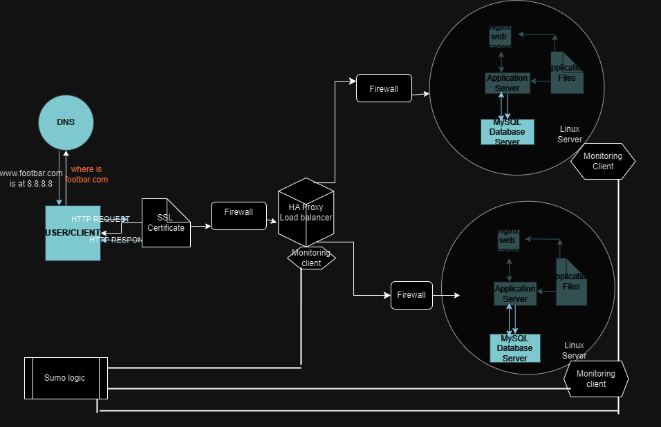

# Secured_and_monitored_web_infrastructure

# Description
Is a 3-web server architecture which is secured,monitored, and serves an encrypted traffic.
It hosts the website "www.footbar.com"
# The specifics
+ Firewalls serve the purpose of safeguarding the network, particularly web servers, against unauthorized access by acting as a barrier between the internal and external networks. They achieve this by scrutinizing incoming traffic and blocking any that matches predefined criteria indicative of unwanted or unauthorized activity.

+ SSL certificates play a vital role in encrypting the communication between web servers and external networks. By encrypting traffic, SSL certificates mitigate the risk of man-in-the-middle attacks and eavesdropping by network sniffers. They ensure the privacy, integrity, and authentication of transmitted data.

+ Monitoring clients are instrumental in overseeing the performance and functionality of servers and external networks. These tools analyze server operations, assess overall health, and promptly notify administrators of any deviations from expected performance. They provide administrators with essential metrics about server operations, conduct automated tests to evaluate server accessibility and response times, and flag issues such as missing files, security vulnerabilities, and other anomalies.
# Issues with the following architecture
+ Terminating SSL at the load balancer level would result in unencrypted traffic between the load balancer and the web servers.

+ Relying on a single MySQL server presents scalability challenges and introduces a potential single point of failure for the web infrastructure.

+ Deploying servers with identical components could cause resource contention issues, including CPU, memory, and I/O, potentially leading to performance degradation. Additionally, this setup may hinder scalability efforts and make troubleshooting more challenging.

