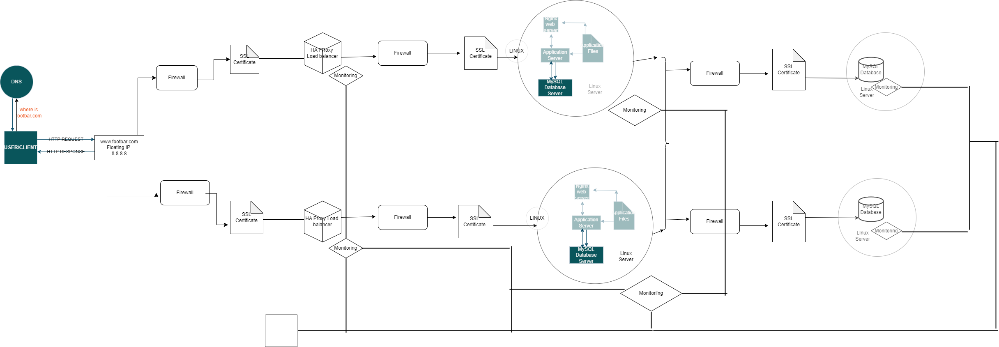

# Scale up web infrastucture

# Description
This updated web infrastructure represents a scaled-up version of the previously described setup. In this iteration, all Single Points of Failure (SPOFs) have been eliminated, and each major component—web server, application server, and database server—has been relocated to individual GNU/Linux servers. SSL protection is not terminated at the load balancer, and each server's network is secured with a firewall. Additionally, comprehensive monitoring is implemented across all servers.
# The Specifics
+ The addition of a firewall between each server.
This protects each server from unwanted and unauthorized users rather than protecting a single server.
# Issues 
+ High maintenance costs.
Moving each of the major components to its own server, means that more servers would have to be bought and the company's electricity bill would rise along with the introduction of new servers. Some of the company's funds would have to be used to buy the servers and pay for the electricity consumption needed to keep the servers (including the new and old ones) running.

